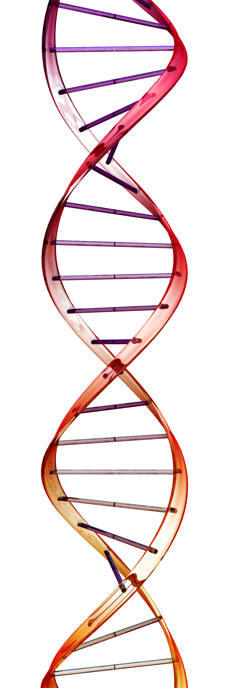

I am a Bioinformatics Analyst for the Epigenetics Consortium at Oregon Health & Science University, specializing in the analysis of Epigenetics genomic sequencing datasets such as Bisulfite Sequencing, ChIPseq, and ATACseq.
Explain what you do. Establish Credibility. Describe professional or research interests. Brag.
Call to action, contact info.

## Current Interests and Projects:

- Genomics
- Bioinformatics
- Epigenetics

#[GitHub Pages](http://laderast.github.io)

#
#
